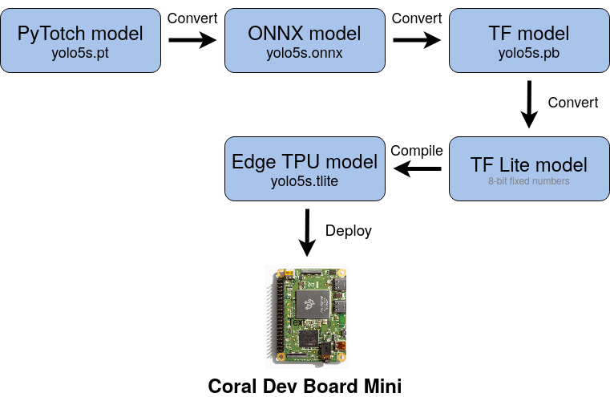

# Export YOLOv5 to Google Coral Dev Mini

<p align="center">
  <a href="https://github.com/ultralytics/yolov5/discussions/3213">
  </a>
</p>

## Step 0: Preparation. Download models.

Clone the repository implementing inference with YOLOv5 models on Google Coral Dev Board Mini

```
git clone https://github.com/maxmarkov/yolov5-coral-dev-mini.git
```

This repository uses YOLOv5 as submodule. Clone the submodule and checkout the latest stable release (v5.0 on July 24)

```
git submodule init && git submodule update && cd yolov5 && git checkout tags/v5.0
```

Install all necessary requirements 

```
cd .. && pip install -r yolov5/requirements.txt && pip install -r requirements.txt
```

Download PyTorch models from YOLOv5 repository into models folder:

```
python download.py --weights yolov5s.pt yolov5s6.pt 
```

## Step 1: Convert PyTorch model into TensorFlow Lite

Coral Dev Board requires the model to be in a TensorFlow Lite format. 
Custom models should be placed into models folder.

<details><summary>Conversion diagram</summary>
<p>



</p>
</details>

### Method 1 (via TensorFlow)

PyTorch to ONNX to TensorFlow to TensorFlow Lite:

```
python export.py --weights models/yolov5s.pt --img 320 --batch 1 --dynamic
```

### Method 2 (via Keras)

Conversion via keras using [this repository](https://github.com/zldrobit/yolov5)

```
cd yolov5-conversion && python3 models/tf.py --weights ../models/yolov5s.pt --cfg models/yolov5s.yaml --img 320 
```

### Method 3 (via OpenVINO IR)

Conversion via OpenVINO IR using [this repository](https://github.com/PINTO0309/openvino2tensorflow)


## Step 2: Deploy model on Coral Dev Board Mini 
